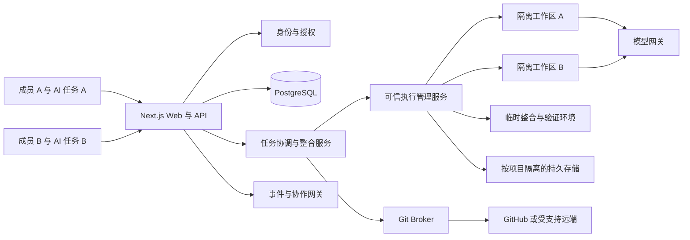

# pi-collab 多人协作开发平台：产品与开发计划

文档版本：v0.4 · 更新日期：2026-09-24 · 状态：实施中，验收未完成

开发顺序修订：基础功能阶段后，按用户最新要求逐模块收尾，对照设计核查缺口并用 Computer Use 实际验收。当前记录见 [逐模块收尾清单](module-closeout.zh-CN.md)，基础阶段记录见 [功能骨架交付清单](foundation-delivery.zh-CN.md)，完整产品范围仍以本计划为准。

实施修订：用户要求无 Docker 为默认本机版本，并保留可选 Docker 版本。两种版本共用业务代码与协作协议；进程隔离与容器安全边界分别验收。此前条款中“必须通过 Docker 开发”的假设已被替代，详见 [双运行后端 ADR](adr/0006-dual-runtime.md) 和 [实施状态](implementation-status.zh-CN.md)。

验收进展：原生双用户、双真实模型编码 → 单任务/组合检查 → 独立测试账号评审 → 本地 Git 推进已于 2026-09-23 完成。详见 [可复现步骤](live-demo.zh-CN.md) 与 [当前证据及剩余范围](implementation-status.zh-CN.md)。这不代表远程 PR、生产部署或全部计划完成。

项目名称（已确认）：**pi-collab**，派生自 pi-web，开发阶段在本机调试。技术基线：`agegr/pi-web` 0.9.2，提交 `040faddfecd98e92d31bcb3a526be06b66f790bb`。

本文用于明确产品边界、架构、交付顺序、验收标准和开发流程。任务分解见 [实施任务清单](implementation-backlog.zh-CN.md)，本机条件与调试步骤见 [本地开发方案](local-development.zh-CN.md)。上游能力已按源码核对；本文其余功能均为拟开发能力，不代表 pi-web 已经支持。

## 1. 决策摘要与计划假设

### 1.1 产品定位

构建一个让团队共同使用 AI 编程代理的协作开发平台：多名成员各自指挥自己的 AI，同时推进同一个项目；平台负责隔离写入、协调依赖、管理共享资源、验证组合结果和合并成果。

已确认的核心需求：**多人同时指挥意味着多个 AI 并行工作，不能通过把所有人排队到一个 AI 上来实现“防冲突”。** 同一会话的控制权只用于旁观和接管，不是团队并行协作的主机制。

产品的核心对象是“任务及其可交付变更”。聊天、编辑器、终端、运行环境和 Git 分支都关联到任务。多人共同编辑同一份代码是可选协作模式，不是所有任务默认共享一个可写目录。

首版必须完成以下闭环：

> 邀请成员 → 配置项目权限 → 导入 Git 仓库 → 拆分任务及依赖 → 多人各自启动 AI/独立工作区 → 声明修改范围并协调接口 → 组合验证 → 评审与 PR → 依序合并并通知其他 AI 更新基线。

### 1.2 暂定假设

- 首批用户为单组织、5–20 人的软件开发团队；自托管，Linux 执行节点；本机 macOS 默认原生进程运行，容器为可选后端，不承诺首版支持互不信任客户共用宿主机的 SaaS。
- 数据模型从第一天包含组织边界；首版 UI 可以只提供一个组织，但隔离测试必须创建至少两个组织。
- 首版优先支持 Git 仓库、GitHub 私有仓库及 PR；GitLab 等通过适配接口后续支持。无远程仓库的项目可本地提交、导出补丁，但不纳入 PR 联动验收。
- 首版优先完成多用户、多 AI 的并行开发与结果整合；共享会话是辅助能力，Overleaf 式实时共同编辑作为独立里程碑。
- 默认私有项目、邀请制加入；项目内资料默认对项目成员可见，不承诺同一项目中的文件级保密。
- 交付估算按 3 名工程师、0.5 名测试/运维支持及兼职产品负责人计算。用户规模、现有基础设施、人员投入变更后重新估算。

多用户各自指挥 AI 并行工作、项目名 pi-collab、派生自 pi-web 和本机调试已确认；团队规模、上线部署等仍是可修改的规划参数。P0 结束前必须形成 ADR，明确首批用户、认证方式、Git 托管方、预算和部署环境。

### 1.3 推荐关键决策

1. 采用受控 fork 改造 pi-web。普通 pi 扩展不足以覆盖 HTTP 鉴权、终端、文件 API 和进程生命周期，因此不把多人平台仅实现为一个插件。
2. 复用聊天、会话展示、模型交互与 Git Diff UI；将账户、权限、任务和运行管理独立成领域模块，减少侵入上游。
3. Next.js 作为 Web/API 控制层，PostgreSQL 保存协作元数据；独立执行服务管理每个工作区的隔离运行环境。
4. 以“一可写 AI 一分支一隔离工作区”为执行规则；普通任务使用一个工作区，并行子任务获得各自工作区。不同 AI 不共享可写 checkout，仍可并行修改同名文件，冲突在整合阶段处理。
5. Git 是已提交代码历史的权威来源；数据库是权限和工作流的权威来源；浏览器状态和内存 Map 不能承担这两类职责。
6. 实时共同编辑采用成熟 CRDT 方案进行验证；CRDT 只处理文档并发，权限、终端写入和 Git 状态仍由服务端协调。

## 2. 上游评估与改造边界

### 2.1 已有能力

- 本地 pi 会话浏览、继续运行、分支、模型设置、文件查看、终端和子代理。
- `PI_WEB_PASSWORD` 共享密码认证，API 用户名固定为 `pi`；不包含独立用户身份。[S1]
- 同一会话支持多个事件监听者；启动请求合并、prompt 接纳串行以及部分运行状态互斥。[S2]
- Git status、diff 与 worktree 创建/切换/删除；未形成平台级提交、推送、PR、审批与合并流程。[S3]
- pi 的本机配置、模型凭据和会话文件复用；部分文件写入有锁。[S4]

### 2.2 首要架构缺口

- 会话、终端和设置围绕本机用户与全局目录组织，没有组织/项目/成员授权链。
- `globalThis` 中的运行注册表和启动锁只在一个服务进程内协调，不能作为分布式所有权机制。[S2]
- 终端在服务宿主机创建；现有项目命令环境清理主要针对框架变量，不构成多用户秘密隔离。[S5]
- 文件与工作目录接口接收宿主机路径；多人平台应由资源 ID 在服务端解析真实路径。
- worktree 共享 Git 元数据，不是安全隔离边界。直接给多个沙箱挂载共同的可写 `.git` 目录会扩大可修改范围。

### 2.3 复用与替换策略

- 保留 `ChatWindow`、`MessageView`、`ChatInput`、模型选择与 Diff 展示的主体；加入操作者、控制状态、权限反馈与任务上下文。
- 将 `lib/rpc-manager.ts` 包装到 `PiRuntimeAdapter`，逐步移入执行环境；禁止 Web 请求直接创建拥有宿主机权限的 AgentSession。
- 将 `lib/session-reader.ts` 改为按已授权工作区读取索引；停用扫描宿主机全部 `~/.pi/agent/sessions` 的团队模式入口。
- 将 `lib/terminal-manager.ts` 移入工作区运行环境，终端必须有 `organizationId/projectId/workspaceId/creatorId`。
- 将 `lib/worktree.ts` 提升为 `WorkspaceBackend` 的一种实现；生产默认使用独立 clone，先保留 worktree 作为同一信任域内的可选优化。
- 将 `proxy.ts` 的共享密码入口替换为用户会话验证；所有业务端点继续独立做资源级授权，不能只依赖中间件。
- `auth`、`models-config`、插件、技能、导出、推送订阅、文件搜索与预览全部纳入授权审计；模型 Provider 凭据与平台用户身份分开管理。

## 3. 用户、场景与范围

### 3.1 核心用户场景

**项目维护者**：创建项目，连接 Git，邀请成员，设置评审和运行预算，查看合并与失败情况。

**开发者**：领取任务，在自己的工作区指挥 AI，使用终端和编辑器，提交可审阅变更，处理反馈。

**评审者**：查看指定提交的差异、讨论和验证证据，提出建议修改，通过或请求修改；不需要获得终端权限。

**协作参与者**：旁观共享会话、补充信息、申请接管运行；系统显示谁拥有控制权，避免两人同时改变代理目标。

**平台管理员**：管理部署、组织、配额和运行节点；不因基础设施身份自动成为所有项目的日常内容参与者。宿主机管理员的技术访问能力不等于产品保证的端到端保密，需明确运维约束。

### 3.2 首版范围：P0/P1

- 邀请制登录、成员管理、角色权限、会话撤销与组织隔离。
- 项目与任务、成员活动、评论及站内通知。
- 隔离工作区、独立分支、多 AI 任务图、范围声明、接口变更协议、共享资源租约、基础整合队列；共享 AI 会话与终端接管。
- Git 差异、选择性暂存、提交、同步远程、PR 联动及状态展示。
- 基于提交版本的评审、验证记录、基础冲突雷达。
- 配额、审计、备份恢复、失败运行回收和上游迁移工具。

### 3.3 后续范围：P2/P3

- 实时共同编辑、光标与选区、建议修改、协作检查点。
- OIDC/企业 SSO、更多 Git 托管方、远程原生合并队列适配、多节点调度。
- 接口契约冲突分析、独立组合验证、交接快照增强、受控预览环境。

### 3.4 首版明确不做

- 自建完整 Git 托管服务、全功能云 IDE、桌面 IDE 全量同步。
- 文件级秘密隔离、匿名编辑链接、跨项目任意目录访问。
- 全语言语义合并、保证“无冲突”的 AI 自动合并、无人审批发布到生产。
- 对外 SaaS 的计费、跨区域容灾和强对抗租户隔离承诺。
- 首版同时支持 Linux/macOS/Windows 三种生产执行环境；保留浏览器跨平台使用。

## 4. 参考产品与可借鉴能力

### 4.1 Overleaf

官方文档包含项目共享、实时协作、评论、修订跟踪、协作者聊天和 Git 集成。[R1][R2]

拟借鉴的体验：项目内成员列表、明确的编辑/查看能力、贴近内容的讨论、建议修改、历史恢复、浏览器中看到共同工作的进度。

针对代码开发的调整：

- 对话按任务、文件或 diff 锚点组织，保留轻量讨论，避免将项目聊天做成另一个通用即时通信系统。
- “接受建议”生成明确补丁并验证基线版本，不直接覆盖他人未提交修改。
- 代码版本恢复产生新提交；恢复未提交草稿前创建快照，不重写共享分支历史。
- 文档共同编辑与 Git 版本历史分层保存，禁止每次按键产生一次 Git commit。
- Overleaf 文档介绍其使用 Operational Transformation；本项目选择 CRDT 是自身技术决策，不声称复制其内部实现。

### 4.2 GitHub/GitLab 类开发平台

借鉴 PR/MR、保护分支、必需检查、代码负责人和合并队列。首个实现适配 GitHub；GitLab 仅为后续方向，不在首版承诺功能对等。

- 评审、测试和批准均绑定提交版本，追加提交后按策略使旧批准失效。
- 路径匹配的负责人帮助确定评审对象，但 CODEOWNERS 不充当文件访问控制。[R3]
- 队列应针对最新目标分支和排队变更验证；GitHub 的原生 merge queue 有仓库/套餐限制，先检测能力，再启用对应 UI。[R4]
- 平台权限与远程 Git 权限取交集；平台内是 Maintainer 不代表拥有远程仓库管理员权限。

## 5. 账户、权限与秘密管理

### 5.1 登录与账户生命周期

首版采用成熟认证库提供邀请制邮箱/密码、服务端可撤销会话和密码重置；候选库为 Better Auth，P0 验证维护状态、许可证、密码哈希与会话撤销能力后锁定版本。认证库验证不过必须调整估算，不自行拼装密码协议。

- 首次安装通过一次性 bootstrap token 创建组织 Owner；完成后永久关闭初始化入口。
- 邀请绑定组织、目标邮箱、预授予角色、有效期和单次使用随机 token；数据库仅保存 token 哈希。更高角色授予需要更高权限。
- 公共注册默认关闭；通过配置允许组织外注册也不能自动获得任何项目权限。
- 密码按认证库维护的成熟方案保存；当前锁定 Better Auth 1.7.5，使用其 scrypt 实现，不自行编写哈希算法。重置令牌单次消费并使旧会话失效；登录、重置和邀请接口限速。
- Cookie 使用 HttpOnly、Secure、合适的 SameSite；变更请求做 CSRF/Origin 校验，不能因为已有 Cookie 就允许跨站写入。
- 用户可查看并注销其他设备会话；禁用账户、退出组织、降低权限后使既有连接和能力令牌失效。
- 首版包含组织 Owner/平台管理员的 MFA 要求与恢复码流程；成员 MFA 可选，企业 SSO 放入 P2。
- 邮件发送通过可配置 SMTP；开发环境使用本地邮件收件器。计划制定阶段不实际发送邀请或邮件。

### 5.2 权限模型

采用“组织成员资格 + 项目角色 + 资源归属/状态条件”的 RBAC/属性组合。每次请求计算具体 capability，不把角色名散落在 UI 和 API 中。

组织角色：Owner、Admin、Member。项目角色：Maintainer、Developer、Reviewer、Viewer。

- **Owner**：组织转让/删除、最高管理与紧急恢复；必须始终保留至少一个有效 Owner。
- **Admin**：组织成员、配额与项目治理；读取项目内容需获得项目成员身份。紧急加入私有项目需填写原因并审计。
- **Maintainer**：项目成员、仓库连接、项目策略、评审与合并；不能绕过远程分支保护。
- **Developer**：创建/编辑获授权任务、启动受配额约束的运行、修改自己的或已获接管授权的工作区、提交 PR。
- **Reviewer**：读取代码与公开给项目的运行记录、评论、提交评审；默认不可执行终端、改变文件或合并。
- **Viewer**：只读项目发布给成员的内容；默认不可评论、运行、下载秘密或执行 Git 写操作。

实现时维护机器可读的 capability 清单，例如 `project.read`、`task.write`、`workspace.control`、`run.start`、`run.stop`、`review.submit`、`git.push`、`git.merge`、`secret.bind`。共享会话邀请和任务分配不能提升项目角色上限。

特殊规则：

1. 任务负责人可以邀请已有项目成员旁观；授予控制资格须满足 Developer 及以上，并受工作区 ACL 约束。
2. Reviewer 的正式批准是否满足合并条件由项目策略决定；默认禁止变更作者独自批准自己的变更。
3. 当前控制者可停止自己的运行；Maintainer 可紧急停止项目内任意运行，记录原因。旁观者只能提出停止请求。
4. 项目秘密是可授权使用的资源，不提供“查看明文”给普通成员；秘密使用权限不自动扩大代码访问范围。
5. 项目成员默认能读项目会话；需私密提示词的个人草稿不纳入首版。导入时必须先检查历史内容再选择共享。

### 5.3 服务端授权边界

- 请求先验证身份，再由数据库加载资源的组织、项目和工作区关系，最后执行策略。禁止相信客户端传来的 `organizationId`、路径或角色。
- ID 不可猜测不等于有权限；嵌套资源同时验证父子关系，避免跨项目替换 session/terminal/artifact ID。
- PostgreSQL 采用复合外键和组织字段；RLS 作为第二道防线。数据库连接池每个事务使用 `SET LOCAL` 设置上下文，不能泄漏前一请求身份。
- Web 业务数据库角色无 BYPASSRLS；后台任务也必须显式带组织上下文，管理迁移使用独立角色。
- SSE/WebSocket、文件下载、导出、搜索、通知、预览与缓存全部按同一权限过滤。禁止仅连接时鉴权、之后永久信任。
- 降权/移除事件触发连接断开与运行处理；5 秒内停止接收其命令、收回 broker 权限并关闭交互连接，30 秒内完成运行停止或明确隔离。
- 已移除成员的进行中任务默认停止并保留快照，Maintainer 可由新的操作者重新授权恢复；不悄悄继承已撤销身份。

### 5.4 模型、Git 与项目秘密

- 密钥加密存储，主密钥独立于业务数据库与代码仓库；支持轮换和备份恢复时的密钥恢复演练。
- Git 凭据保存在 Git broker，优先 GitHub App 安装令牌；代理/终端不持有可写远程仓库的长期凭据。
- 首版模型共享凭据通过 Model Gateway 使用，校验组织、项目、run 与预算。Pi Provider 的流式协议和工具调用兼容性是 P0 验证项。
- 不支持 Gateway 的 Provider 先标记不可用；可选的 BYOK 直连作为隔离沙箱内显式风险模式，不能默认把全组织模型密钥注入终端。
- 运行时环境采用白名单；不继承 Web/数据库/SMTP/云账户环境；不挂载宿主机 HOME、SSH agent 或 Docker socket。
- 项目运行秘密如确需注入，必须声明该工作区中的代码、构建脚本和代理均可能读取它；权限不足者不能控制该工作区。提供无秘密测试配置。
- 日志、补丁、导出和 AI 交接摘要有脱敏与秘密扫描，扫描只能降低风险，不能作为绝不泄漏的保证。

## 6. 协作对象与交互设计

### 6.1 项目与任务

项目保存仓库连接、默认分支、成员、模型策略、预算和验证配置。任务保存目标、验收标准、负责人、参与者、预期修改范围、依赖任务、关联工作区和 PR。

任务状态：`draft → ready → in_progress → in_review → ready_to_merge → done`；支持 `blocked/cancelled`，必须保留状态变更记录。

- AI 可草拟任务和验收标准，由成员确认；不自动授予权限或启动有费用的运行。
- 成员加入或角色变更与任务分配分别处理；分配任务不自动加入项目。
- 任务列表展示负责人、分支、正在运行的代理、待处理反馈与可能重叠的任务。

### 6.2 共享会话与控制权

首版提供“旁观、评论、申请控制、交接控制”四种交互。发给 AI 的指令必须显示实际操作者；普通成员评论不会自动进入模型提示词。

- 同一 session 的 `prompt/steer/follow_up/abort/set_model/compact/fork/navigate_tree/reload` 都要分类授权；不能只保护 prompt。
- 当前控制者可将评论选入代理上下文；记录来源和引用，明确这是项目内容而不是系统权限。
- 终端有独立显示尺寸偏好，但输入权绑定工作区控制租约；旁观者的 resize 不应打乱控制者终端。
- 默认一个工作区只允许一个可写 AI 运行或终端/人工写入主体。切换写入主体必须先暂停旧运行并等待退出写入阶段。
- 并行只读代理可共享快照；并行可写子代理必须获得独立子工作区，其结果以补丁/分支回收，纳入同一配额与审计。

### 6.3 评论、建议与通知

- 评论锚定任务、会话消息或 `commit SHA + path + blob hash + diff position`；代码变化后尝试重定位，失败显示“锚点已过期”，不挂到无关代码。
- 评论有讨论/解决状态；提交评审与普通评论分开。审批只作用于明确 revision。
- 建议修改保存为补丁及基线 hash；应用前校验工作区版本与写入权。冲突返回可预览结果，不静默部分应用。
- 通知覆盖被邀请、被提及、控制请求、运行待输入、评审请求、CI 失败和合并结果；支持任务订阅、去重与静默时间。
- 首版站内通知；邮件摘要可选。Slack 等外部通知在独立集成中显式配置，不默认对外广播项目内容。

### 6.4 实时共同编辑：P2

共同编辑是一个独立协作房间，绑定一个任务工作区和明确成员集合。Monaco + Yjs 作为 PoC 候选；使用服务端授权的 WebSocket provider，不能直接接入公开 demo 服务。[R5]

- 首期只支持 UTF-8 文本，单文件建议上限 1 MiB；大文件、二进制、子模块、LFS 指针和生成目录使用普通 Git 工作流。
- 支持多人光标、选区、在线状态、跟随阅读、个人撤销、评论与建议。共同编辑并不意味着共享终端输入。
- Yjs 文档是房间内未提交文本的权威来源；磁盘是按检查点生成的投影。服务器持久化 update 日志与压缩快照，确认写入后才向客户端表示“已保存”。
- 文件创建、删除、重命名使用单独的带版本目录操作协议；不声称文本 CRDT 自动解决路径冲突。
- Agent 编辑、终端写文件、checkout/rebase/merge 必须退出共同编辑写入模式：冻结更新、确认持久化、记录检查点和版本，取得独占写入权，执行后以新 epoch 重建文档。
- 旧 epoch 的离线更新只能进入恢复草稿，不能盲目合入新的 Git 基线；提供差异预览和人工选择。
- 编辑状态下的运行预览从只读检查点生成独立构建目录，禁止构建脚本回写协作文档目录。
- 无法控制外部写入者时，不启用实时共同编辑。首版不承诺用户可同时在本地 IDE 直接修改同一服务器目录。

## 7. Git 与代码交付流程

### 7.1 仓库连接与工作区

首版提供可配置的 GitHub App 集成。导入时绑定稳定的 provider/repository ID、默认分支和安装授权；仓库改名不依赖 URL 字符串追踪。

- Git 操作由服务端 broker 执行，使用参数数组、`--` 分隔、超时与输出上限，不拼接 shell 字符串。
- 远程地址限定允许的 HTTPS/SSH 形式及主机策略；禁止任意 `file://`、本机路径和未知 remote helper。对内网 Git 的放行需管理员配置，避免仓库导入成为 SSRF/宿主机文件入口。
- 初次导入不开启任意 submodule、LFS 下载或仓库脚本执行；后续支持需明确凭据和资源策略。
- 每个独立工作区创建本地 `task/<workspace UUID>` 分支并记录 `baseSha`。远程任务分支固定为 `pi-collab/tasks/<task UUID>/workspaces/<workspace UUID>`，由服务端生成；同一任务的不同工作区也不会共用可写分支。仅同一工作区可快进更新其远程分支，原操作结果未知时保持占用；首版不接受任意已有远程分支绑定。
- 工作区默认独立 clone/对象库，不使用可写硬链接或共享 alternates 作为首版实现。磁盘成本高于共享 worktree，是隔离与简化恢复的主动取舍。
- 缓存优化后续采用按项目隔离、可验证的只读对象缓存；挂载必须不能追溯到其他项目数据。

### 7.2 开发与提交

当前状态（2026-09-24）：以下迁移 026–035 的进度段落是阶段历史；其中当时未接通的 PR/CI、管理员处置及 Docker 基础流程，已在后续 F4/F6/F7 接通。真实外部账户验收和本轮逐模块复验仍未完成。下列功能要求继续有效。

1. 选择任务与目标基线，显示工作区对应分支。
2. 人或代理修改并运行验证；平台记录执行主体与配置版本。
3. 开发者检查 diff，选择暂存文件/片段，确认提交说明；不自动提交目录中所有文件。
4. 提交前冻结可写运行，校验工作区 revision、HEAD、index 和文件 hash；不匹配则让用户重新检查差异。
5. commit 记录确认提交的成员；AI 贡献以平台 provenance 与可选 trailer 标识，不伪造他人的作者签名。
6. 推送通过 broker；默认只允许任务分支且禁止 force push。需要重写历史时走单独权限、明确预览与审计。
7. 创建 PR，并附目标、范围、测试结果、风险与证据链接。GitHub 远程 PR 编号与本地 ChangeRequest 关联。

保留用户在工作区内正常使用 Git 查看和创建本地提交的能力；这不授予远程推送权限。平台必须检测外部本地 Git 状态变化，使过期 diff 和批准失效。

实施进展：原生检查与精确计划区分 HEAD、index、工作文件并绑定运行退出证据；专用进程实际执行片段/整文件暂存、取消暂存和确认提交，保留其余草稿。迁移 026 和独立 Git 服务已接入持久请求、成员/任务权限版本、最终效果门禁、审计及快照互斥；写入确认与清理/进程退出分别记录，未知结果不重放。浏览器已有逐层预览、片段选择、逐文件核对及完整提交确认；同一窗口刷新保留未确认请求编号，双成员并发/响应丢失/原操作核查已有验收流程。非文本内容需按摘要在外部检查并明确确认，排除内容阻止提交。缺少对应原生记录或存在不确定 Git 锁时继续占用，无强制解锁入口。远程 push/PR/CI、证据不足时的管理员处置及 Docker 对等验收仍待完成。细节见 [ADR-031](adr/0031-workspace-git-plans.md)、[ADR-032](adr/0032-native-workspace-git-operations.md)、[ADR-033](adr/0033-workspace-git-broker.md) 与 [ADR-034](adr/0034-browser-workspace-git.md)。这一步不算 §7.2 完成，默认仍不依赖 Docker。

任务分支 push 的内部协议已能生成固定任务/工作区分支、核对快进关系、固定发送字节并执行远端旧 SHA 原子比较；实际竞争与未知回包的只读观察已有真实 Git 验证。现已加入停止工作区的完整新增历史检查与不可变导出，包含中间提交、合并支线、提交说明和原始字节/模式，后续源文件变化不会改写原导出。内部 GitHub 写入客户端已加入单仓库短期令牌、固定仓库身份/可见性、当前保护及规则检查和最终授权回调；Git 效果与令牌撤销结果分开保存。远端只读基线证据与当前 SQL 权限已在迁移 027 的预览阶段绑定；写入凭据与持久发送队列现由下述迁移 029 接通，真实 GitHub 账户验收仍待完成。见 [ADR-035](adr/0035-task-branch-push-protocol.md)、[ADR-036](adr/0036-task-push-history-exports.md) 与 [ADR-037](adr/0037-github-task-push-capability.md)。

远端证据的内部获取已接通只读预览：用单仓库读取令牌核验默认分支及任务引用，在独立目录下载完整基线，传输后复查身份/可见性/规则/引用并撤销令牌，再固定完整新增历史导出。远端已前进且新对象不在本地时，也不修改原工作区或公共基线。预览请求不接受客户端指定的远端 SHA 或观察 hash。迁移 027 已将请求持久化，在读取凭据前去重，固定当前成员/任务/运行/安装/绑定版本，与暂存/提交和快照双向互斥；独立 Git 服务检查持续授权，并在发布前重新核验原导出与 SQL 计算的证据 hash。只读连接丢失后旧请求失败，不重读或补建原导出；远端写入的未知结果仍须保留目标占用，不能套用此读阶段规则。完整新增历史已接入浏览器逐提交审阅、明确的远端默认基线比较与原始字节下载；读取绑定 SQL 清单 hash，并在读取前后复查项目权限。页面审阅标记仅保留在本窗口，不构成推送授权；持久完整确认现已由下述迁移 028 接入，显式发送队列见下述迁移 029。浏览器设计见 [ADR-040](adr/0040-browser-outgoing-history.md)，只读准备见 [ADR-038](adr/0038-authenticated-task-push-previews.md) 和 [ADR-039](adr/0039-durable-task-push-previews.md)。

迁移 028 已接入持久完整确认及未发送的目标占用：逐提交说明/父关系与全部文件版本核对后，成员明确确认仓库、可见性、生成 ref、旧/新 SHA 与完整历史披露范围。SQL 固定完整提交清单、对象 hash、当前授权版本，并对全局 GitHub 仓库 ID + ref 保证单一占用者；响应丢失同键重试不重复占用，撤权/重新授权不恢复旧确认。未发送的记录可由当前任务控制者有原因撤回；已有确认不会随未来版本升级自动发送。它是成员声明，不等于软件证明人实际理解了内容。实际发送由下述迁移 029 单独接入持久队列、发送字节最终门禁和未知远端效果保留；原确认协议详见 [ADR-041](adr/0041-durable-push-confirmations.md)。

迁移 029 接入显式发送请求、同一导出唯一发送任务、当前双成员授权、固定字节及新鲜远端证据的最终 SQL 门禁。只有成功收到授权事务 COMMIT 回应后才发出一次请求；发送结果与凭据清理分别保存。未知效果保留全局目标占用，重试/换成员/换编号均不能重发。兼任项目维护者、启用 MFA 的组织管理员可明确封存未知任务，永久隔离旧分支，再从新工作区继续。默认本机原生服务仍共用两个通道；PR/CI、真实外部账户与 Docker 对等验收仍未完成。见 [ADR-042](adr/0042-durable-task-push-delivery.md)。


### 7.3 更新基线与冲突处理

- dirty 工作区先保存草稿快照，再让用户选择处理方式；禁止自动执行 `reset --hard`、丢弃未跟踪文件或静默 rebase。
- 比较最新目标分支，在临时整合工作区尝试 merge；原任务工作区保持可恢复。
- 展示冲突文件及 base/ours/theirs；AI 可以提出候选补丁，成员审核后应用并重跑受影响检查。
- Git 文本无冲突不代表业务兼容。最低要求执行项目配置的检查；基础冲突雷达和接口检查只能作为辅助信号。

### 7.4 评审与合并

当前状态（2026-09-24）：以下是迁移 030–035 的阶段历史；固定版本独立评审与经典分支保护下的显式合并已由 F4 接通，见 [Git 交付说明](git-delivery.zh-CN.md)。旧段落中的“仍须完成”不代表当前没有实现，也不代表真实外部服务已验收。

草稿 PR 的内部 Provider 协议已接通：先以单仓库只读令牌观察已推送的固定任务 SHA 与最新默认基线，再准备固定说明、版本引用与请求 hash；独立 PR 写入令牌仅能创建草稿，不具备代码写入或合并能力。GitHub 创建接口没有 head/base SHA 的原子比较参数，故创建后必须区分实际 PR 已创建与当前版本是否匹配；漂移、回包未知或清理失败均不能被误报为 CI/评审通过。该 Provider 能力本身不提供持久授权或幂等；实际创建须与 push 共享全局 head 占用，不能只靠内存对象防重。见 [ADR-043](adr/0043-github-draft-pull-protocol.md)。

迁移 030 将只读 PR 提案接入持久队列、当前权限/任务版本、一次领取与失联恢复、SQL 独立字节校验及浏览器。来源仅允许已确认接收的推送；原工作区后续草稿不参与，较新目标基线无须重推代码。浏览器保存原请求以便刷新重试，展示完整生成内容及已有 PR 观察；此步骤不创建 PR、不发通知，也不保留发送占用。见 [ADR-044](adr/0044-durable-pull-proposals.md)。

迁移 031 增加独立的实际创建确认与持久发送队列：用户核对完整标题/正文、目标和通知影响后才接纳，与 push 共用稳定 GitHub 仓库 ID + head ref 占用；最终 SQL 授权的提交回应必须成功返回，才允许一次创建 POST。未知结果继续占用，封存永久隔离；不能凭当前没有 PR 或正文标记重新发送或接管。已确认创建保存初始 ChangeRequest 与不可变创建/后续观察，源/目标漂移及凭据清理分别记录。完整 diff hash、持续 revision/可信 CI/评审/受保护合并仍须完成，初始观察不是完整版本验收。见 [ADR-045](adr/0045-durable-draft-creation.md)。

迁移 032 增加已归属 PR 的手动只读观察队列：按当前任务/成员及安装关联授权，固定 PR ID/number/node ID，每次成功追加源/目标 SHA、内容摘要和开关状态；观察版本与最新指针在同一事务推进。失败、取消或失联不覆盖旧证据，404 不推断删除；旧创建者离开团队不阻止当前维护者继续读取。页面轮询只读取已保存历史，不自动请求 GitHub。迁移 033/034 已接入完整固定 Git 差异和按准确 head SHA/可信生产者读取的 CI；迁移 035 已接入签名事件与旧证据失效，详见 [ADR-049](adr/0049-signed-github-events.md)。见 [ADR-046](adr/0046-durable-pull-observations.md)。

- `ChangeRequestRevision` 保存 source SHA、target SHA、diff hash；评审和验证绑定 revision，source 变化后撤销旧的有效批准。
- target 变化后重算可合并性并重新验证组合结果；是否保留人工评审由项目策略决定，必须显示其原始基线。
- 合并要求项目权限、远程权限、必需评审、必需检查和无未解决阻塞同时满足。
- 首版优先使用 GitHub 的保护分支与“分支须更新”等远程约束，并调用支持 expected source SHA 的合并 API。仅靠客户端先查再合并无法保证目标分支未变化。
- 若无法配置远程保护或验证原子性，平台只提供 PR/状态跳转，不显示“受保护的自动合并”能力。
- P2 优先接入原生合并队列；自行实现队列时必须以 repo/target branch 串行化，在临时集成提交上验证，再使用远端支持的原子条件更新。远端不支持时退回人工流程。
- CI/Webhook 校验签名、installation/repo 归属、delivery ID 去重；只相信受信任 CI producer 对具体 SHA 的检查，不把代理输出“测试通过”当作验证。

### 7.5 归档与恢复

合并后保留会话、审计、证据、PR 链接与最终 SHA；工作区停止并进入可恢复保留期，默认 7 天后回收计算资源。删除任务分支需确认无其他引用。恢复共享历史使用 revert 新提交，不重写默认分支。

未提交文件、JSONL、附件和 Git ignored 文件是否备份需要显式清单；不能把“已 push”当作完整工作区备份。

## 8. 多用户、多 AI 并行协调协议（首版核心）

### 8.1 冲突分类与约束

不能用一个全局锁解决所有冲突。不同冲突采用不同策略：

- **文件覆盖**：每个可写 AI 有独立 checkout 与可写卷，物理上不覆盖另一 AI 的未提交内容。
- **重复劳动与重叠修改**：范围声明、任务图和冲突雷达提前提示；一般不禁止多个分支修改同一文件。
- **接口不一致**：在开发前发布版本化契约；依赖方固定契约版本，变更须获得受影响任务确认。
- **代码合并冲突**：在隔离整合区尝试组合、运行检查，失败时生成有归属的解决任务，禁止两个 AI 反复互相覆盖。
- **共享副作用**：数据库迁移、共享测试环境、部署槽等优先复制隔离；无法隔离的资源通过 broker 租约和 fencing 控制。
- **过期结果**：所有成果附基线、依赖 SHA、执行 epoch 与验证版本；基线变化使相关证据过期。
- **指令冲突**：各用户仅控制自己获授权的 AI；跨任务建议进入收件箱，不直接变成另一个 AI 的高优先级指令。

平台保证隔离与流程约束，不保证自动解决所有语义矛盾。检测不到的业务冲突仍依靠明确验收、组合测试和人工评审。

### 8.2 任务图与调度

每个任务声明目标、验收项、负责人、预期范围、依赖任务和输出。平台维护有向无环图，提交依赖时检测环。

- 无依赖任务同时运行。默认项目最多 8 个活跃可写 AI，每位成员最多 2 个，作为可配置的起始值，实际限制受节点资源和模型配额约束。
- 对严格依赖，只有上游发布可消费的不可变产物/接口版本后才启动下游；不一定等待上游最终合并。
- 对软依赖，允许下游使用已确认的契约或 mock 开发，状态标记为“待真实依赖验证”，不得直接进入可合并状态。
- 并行子代理继承发起人的权限上限、任务配额与资源预算；每个可写子代理获得独立工作区，不能绕过并发限额。
- 队列按项目优先级、用户公平份额与等待时间调度，设置重试上限；不让一个用户派生子代理占满资源。
- 计划代理可以提出拆分和依赖建议；调度、授权、预算和租约由确定性的服务执行，不能把这些决定交给 LLM 自由输出。

### 8.3 范围声明与契约协商

`WorkIntent` 至少包含任务、run、预期路径集合、可选符号/API 标识、变更类型和预计完成时间。

1. AI 启动时读取项目任务快照与相关已发布契约，提交预期修改范围。
2. 协调服务检查范围重叠与现有接口变更，返回告警和相关任务，而不是自动把整个仓库锁住。
3. AI 扩大范围时更新声明。平台按实际 diff 对照声明，漏报会被记录并提示，不依赖代理诚实自报。
4. 涉及公共 API、数据库 schema 或共享配置时，创建 `ContractProposal`，包含当前版本、预期版本、兼容策略与受影响任务。
5. 受影响任务负责人确认，或由 Maintainer 明确裁决。AI 可以自动检查并提出意见，首版不替成员批准破坏性变更。
6. 合同确认后发布不可变 `ContractRevision`；变更后的依赖任务进入 `needs_revalidation`。

普通范围声明是协作信号，不是文件访问权限。公共接口“负责人”也不是永久独占文件；冲突可通过拆分、共享契约、串行化特定变更或人工裁决解决。

### 8.4 受控消息与平台工具

计划通过 pi 扩展暴露窄接口，以下为拟定工具名，需在实现中版本化：

- `collab.get_context`：读取当前任务依赖、契约、范围告警和允许使用的资源。
- `collab.declare_intent`：申报/更新修改范围。
- `collab.propose_contract`：提交接口方案或兼容性问题。
- `collab.send_note`：向获授权的相关任务发送结构化问题/结果引用。
- `collab.publish_result`：提交候选 SHA、产物和验证申请；不直接标记合并成功。
- `collab.request_resource`：申请受管理资源；成功后由 broker 执行受限动作，不直接返回长期秘密。

消息包含源用户、源 agent/run、目标任务、类型、引用版本和幂等 ID。系统生成的依赖失效/权限撤销是控制事件；用户或 AI 的自然语言内容始终是数据，不能覆盖权限、执行任意远程指令或获取其他任务秘密。

### 8.5 整合服务与冲突解决

整合服务为每个 `repository + target branch` 维护队列。多个 AI 的开发与测试继续并行，只有更新集成基线/远端受保护分支的阶段串行。

`published → queued → integrating → checking → awaiting_review → ready → merged`

失败分支为 `conflicted/check_failed/stale/cancelled`，不修改其他成员的源分支。

- 每个候选记录 source SHA、target SHA、依赖候选 SHA 和策略版本；整合器创建临时工作区，验证实际组合，而不只验证各自分支。
- 任务有依赖时按拓扑排序整合；与其他任务合并顺序变化后重算候选和检查。
- 冲突归属于具体候选，生成解决任务，指定一名负责成员和可选解决 AI。解决 AI 在新分支提出补丁，原作者可复核。
- 如果冲突本质是需求矛盾，转 Maintainer/产品负责人裁决；禁止不断自动重试生成不同补丁消耗预算。
- 首版限制自动解决尝试次数为 1，且只生成建议；应用建议和合并仍由已授权成员确认。
- 合并后发布新的基线事件；依赖它的 AI 在安全点收到更新。禁止后台强制 rebase 正在写入的工作区。
- 在旧基线继续的任务可完成当前步骤，但其结果不能绕过重新整合和检查。

### 8.6 租约、断线和共享资源

- 数据库为工作区写入者、运行所有者和共享资源租约的权威来源；租约包含 owner、expiresAt、递增 epoch/fencing token。
- 参考参数：心跳 5 秒、租约有效期 30 秒，最终值由故障测试决定；不以浏览器在线状态替代服务端运行租约。
- 过期执行器的命令、回调、publish 与资源变更均被 broker 拒绝。旧进程可能仍运行时，先停止/隔离；无法证明已停止就创建新工作区，绝不复用其可写卷。
- 租约自动过期并不保证数据库迁移或远程部署已停止。对不接受 fencing 的外部服务，broker 持续追踪作业，未知结果进入 `reconciling`，确认终止/完成前不授予下一位。
- 多资源申请采用固定排序或原子批量获取，等待有超时和取消，避免死锁；长等待不持有无关资源。
- 每个工作区的测试使用独立端口命名空间、数据库/schema 或隔离实例。只有明确申请共享环境时才使用共享租约。
- 若终端可直接连接共享数据库，应用层锁就能被绕过。因此共享环境凭据不进入普通终端，网络策略和 broker 是执行约束的一部分。

### 8.7 具体场景与验收

成员 A 的 AI 修改后端订单 API，成员 B 的 AI 开发前端页面，成员 C 的 AI 增加数据库字段：

1. 三个 AI 同时启动，各有工作区。C 发布 schema 契约；A 发布 API 契约，B 据此使用 mock 开发。
2. B 和 A 同时修改生成的客户端文件时，雷达提示重叠；约定由专门生成任务产出，两个原任务减少重复修改。
3. C 的迁移在隔离数据库验证，A 对固定 schema 版本测试，B 对固定 API 版本测试。
4. 整合器按 C → A → B 组合，运行数据库迁移、接口契约测试和端到端订单测试。
5. 若 A 临时改字段名，B 的依赖证据失效并收到明确提示；系统禁止旧结果直接合并。
6. 若 B 的浏览器断线，B 的 AI 仍可按已有任务授权运行；若账户权限撤销，则按撤销策略停止。两种情况不能混同。

验收至少证明：三个 AI 确实有执行时间重叠；没有交叉覆盖未提交文件；同一共享资源仅一个有效变更者；过期执行器不能发布；不兼容组合不能进入可合并状态。

## 9. 有特色且可交付的功能

### 9.1 冲突雷达与团队任务地图（P1）

展示“谁的 AI 正在做什么、打算改哪里、依赖谁、哪些成果可能相互影响”。首版依赖真实 Git diff、WorkIntent、路径重叠和任务 DAG。

告警分为重复目标、文件重叠、契约变更和目标分支落后。每条附证据、相关任务和处理动作；不根据 LLM 一句判断阻断无关工作。接入 AST/语言服务的符号级分析放到 P2。

验收：为预设场景检出同文件重叠与过期契约；路径无交集的任务不生成同类告警；实际修改超出声明能被发现。试点记录误报和有用告警比例，再制定语义检测指标。

### 9.2 变更证据包（P1）

每个候选变更自动汇集需求/验收项、diff、确切提交、基线、环境镜像 digest、测试命令与退出码、产物 hash、评论和审批。

CI/受信任验证服务独立产生检查记录；代理自述与确定性检查分别标记。证据包不包含模型私有推理链，只包含可见交互、工具调用摘要及可验证结果。

验收：修改任何受验证输入后旧证据标记过期；评审者能从任意“通过”状态追溯到 SHA、命令和受信任执行记录。

### 9.3 AI 任务交接快照（P1 基础，P2 增强）

接手人看到任务目标、当前分支/基线、已改文件、未完成项、依赖、最近失败和下一步建议，可在隔离工作区恢复。

快照固定 commit 与未提交补丁/未跟踪文件清单；默认排除秘密和大文件。更换模型/成员只携带经过共享授权的上下文；新任务重新授予运行权限，不复制旧控制令牌。

验收：接手人不依赖原浏览器也能还原指定代码状态、复现最后一次验证，并识别未捕获的环境依赖。未快照的外部服务不声称可完全复现。

### 9.4 组合验证预演（P1 手动触发，P2 自动建议）

在合并前选择多个任务的候选 SHA，创建一次临时集成验证，提前发现“各自测试通过、组合失败”。预演结果不直接写回主分支。

验收：报告注明完整候选集合与整合顺序；任一候选更新后结果失效；失败环境能导出受控日志并自动回收。

### 9.5 评审者可复现预览（P2）

从已验证检查点创建短生命周期环境，让 Reviewer 查看功能和日志，无需获得项目终端权限。预览使用独立域名/来源、访问令牌、无生产秘密和到期销毁，避免不受信任项目页面继承控制台 Cookie。

### 9.6 项目协作记忆（P2）

保存已确认的接口契约、设计决策、失败经验和可复用验证命令，附来源与适用版本。AI 提出条目，由维护者批准；历史条目可失效、回滚。

项目记忆影响上下文，不拥有授权能力。不能通过修改仓库文本来关闭审计、扩大权限、解除分支保护或增加预算。

## 10. 技术架构、数据和协议

### 10.1 部署结构



首版同一代码仓库中保留现有 Next.js 布局，新增 `lib/collab/` 领域模块、`services/executor/` 和 `services/coordinator/`。可以先同机部署为不同进程/容器，避免先为拆微服务重写全部 UI；信任边界必须真实分离。

- PostgreSQL 同时承担元数据、命令 inbox、outbox 和小规模调度；使用行锁/唯一约束保证状态迁移。
- Redis 首版可不引入；有多节点 presence/广播需求再增加。不能将不持久的 pub/sub 当作可靠命令队列。
- 持久附件/JSONL/快照使用存储适配器；单节点可挂独立数据卷，后续支持 S3 兼容对象存储。数据库只存索引和校验信息。
- 默认开发与受信任本机试点采用原生进程和本机 PostgreSQL，无需 Docker；Docker Compose 是可选部署配置，两种配置共用业务代码和协作协议。
- 需要执行不受信任项目代码时，使用经过隔离验收的部署配置。可选容器使用资源限额和网络策略，Docker socket 不暴露给 Web、代理或项目代码；对抗性多租户 SaaS 必须另立隔离评估，考虑专用节点/VM。

### 10.2 运行隔离与 pi 兼容

- 每个工作区使用独立 `PI_CODING_AGENT_DIR`、HOME、会话目录和允许的配置；控制层不在同一进程切换全局环境变量模拟多个用户。
- pi SDK、扩展和子进程在工作区沙箱内运行；配置兼容与扩展安装以工作区或受审镜像为单位，不允许网页安装包到控制服务宿主机。
- Docker 配置：非 root、只挂载当前工作区、只读基础镜像、CPU/内存/PID/磁盘上限；显式限制网络和云 metadata 访问。原生配置验证独立进程/clone/profile 与普通子进程清理，不将同一系统用户下的目录分离宣称为安全沙箱。
- Runner 到控制层使用短期、限定 run/epoch/capability 的令牌与节点身份；不能访问数据库全权限连接串。
- 队列或控制层失联时不接收新的命令/资源使用；沙箱在租约策略下暂停/终止，保留已持久化结果。
- 第三方扩展也是不受信任代码，不能因为“pi 插件”就绕过沙箱或获得项目外秘密。

### 10.3 核心数据对象

- 身份：`User`、`AuthIdentity`、`AuthSession`、`Organization`、`Membership`、`Invitation`。
- 项目：`Project`、`ProjectMembership`、`RepositoryConnection`、`SecretBinding`、`PolicyRevision`。
- 任务：`Task`、`TaskDependency`、`WorkIntent`、`ContractProposal`、`ContractRevision`。
- 执行：`Workspace`、`AgentSession`、`AgentRun`、`Command`、`ControlLease`、`ResourceLease`、`Terminal`。
- 交付：`ResultCandidate`、`IntegrationAttempt`、`ChangeRequest`、`ChangeRequestRevision`、`Review`、`CheckRun`、`Artifact`、`Checkpoint`。
- 协作：`CommentThread`、`Comment`、`CoordinationMessage`、`Notification`、`AuditEvent`、`OutboxEvent`。
- 共同编辑阶段新增 `CollabDocument`、`DocumentEpoch`、`DocumentUpdate` 与快照；不挤入 Git commit 表。

关键约束：

1. 组织级对象带 `organization_id`；项目下对象带 `project_id`，复合外键禁止父子跨组织/项目。
2. workspace 与 session/run 显式关联，JSONL 路径是服务端存储细节；不向客户端暴露宿主机绝对路径。
3. 活跃工作区写入租约唯一；活跃任务分支占用唯一；命令 `(scope, idempotency_key)` 唯一。
4. 同一任务多次 attempt 都保留；run 绑定发起成员、agent、授权快照、当前政策版本与 epoch。
5. 审批绑定 revision，CheckRun 绑定被验证输入和 producer；不能用一个全局 `passed=true` 字段表示所有版本有效。
6. 审计在应用权限范围内追加写；如需抵抗数据库管理员篡改，另外导出不可变存储，首版不宣称“不可篡改账本”。

### 10.4 API 与命令协议

接口按资源 ID 设计，例如：

```text
POST /api/orgs/:orgId/invitations
POST /api/projects/:projectId/tasks
POST /api/tasks/:taskId/runs
POST /api/runs/:runId/commands
POST /api/tasks/:taskId/intents
POST /api/projects/:projectId/contracts
POST /api/workspaces/:workspaceId/control-transfers
POST /api/workspaces/:workspaceId/git/commits
POST /api/tasks/:taskId/candidates
POST /api/projects/:projectId/integrations
POST /api/change-requests/:changeId/reviews
GET  /api/projects/:projectId/events?after=:sequence
```

命令需要 `commandId/idempotencyKey/expectedRevision/expectedHead/leaseEpoch` 中适用的字段。服务端保存接纳状态后返回 `202 + commandId`；客户端重试返回同一命令，不再启动第二个 AI。

状态为 `accepted → dispatched → running → succeeded/failed/cancelled/unknown`；超时但无法确认副作用时用 `unknown` 并对账，不盲目重试 bash、push 或部署。网络系统不承诺所有副作用 exactly-once，依靠幂等、检查和人工恢复。

`AgentRun` 状态为 `queued → starting → running ↔ waiting_input → stopping → completed/failed/cancelled`，另有 `reconciling`。权限撤销、失联、预算耗尽与正常完成分别记录原因。

### 10.5 事件同步与一致性

- 控制消息经数据库事务 + outbox 可靠投递；每个 run/工作区使用单调 sequence，客户端按 event ID 去重。
- SSE 保留为聊天输出通道，WebSocket 用于 presence/共同编辑。连接建立和订阅每个资源时均授权，消息不能任意选择其他 room。
- 断线使用游标补发；超出保留窗口返回完整授权快照再继续增量，不无限保存每个 token 的推送帧。
- 已确认的业务状态持久化；高频 token 可合并批量落盘，必须说明最后一小段未确认输出可能在进程崩溃时丢失。
- 缓存键包含组织/项目/权限版本。列表、搜索索引和活动 feed 不从全局运行 Map 直接广播给所有客户端。
- presence 是短期状态；“成员离线”不等于“其 AI 已停止”，UI 分开展示。

## 11. 非功能目标与验收基准

以下为设计目标，尚未压测验证。P0 固定硬件、数据集与测量方法，若目标不成立须调整方案/容量，而不是在演示中忽略失败。

### 11.1 容量与交互

- 参考测试环境：控制层 4 vCPU/8 GiB；执行层至少 8 vCPU/32 GiB，按工作负载调整；数据库与磁盘性能单独记录。
- 测试负载：20 名在线成员，8 个实际同时运行的 AI，每个 run 至少 3 个事件订阅者；覆盖两个隔离组织。
- 无外部服务依赖的普通 API P95 < 500 ms；已接纳协调事件到在线客户端 P95 < 1 s。LLM 首 token、Git 远端和构建时长单独展示。
- 连接恢复后 5 秒内补齐测试数据规模内的持久化业务状态；缓存失效时允许回全量快照。
- 资源不足时排队并展示原因，不能通过无上限创建容器或子代理达到“并行”。

### 11.2 正确性与隔离硬门槛

- 两组织互猜 ID、复用下载 URL、订阅 room、搜索或调用终端均不能跨越边界。
- 100 个并发重复启动请求使用同一幂等键，只创建一个逻辑 run/有效执行者。
- 多个 AI 的实际运行区间重叠；写入各自同名文件不会改变其他工作区的 hash。
- 旧 epoch、权限已撤销和依赖已失效的候选不能发布为有效成果或合并。
- 管理员/拥有者/作者/评审者的敏感能力逐项覆盖正反测试，所有变更端点均有可追踪授权决策。
- 所有配置均不得主动向 Pi 环境/profile 注入控制层长期密钥或远程主分支写凭据；“恶意脚本无法读取宿主秘密和其他工作区”是隔离部署配置的额外硬门槛，原生受信任模式不能宣称通过此项。

### 11.3 恢复与预算

- 故障注入覆盖控制层重启、Runner 崩溃、网络分区、DB 短时不可用、Git push 已成功但响应丢失、CI webhook 重复乱序。
- 已确认的命令和业务状态不得因单进程重启丢失；无法判断副作用的命令保持 `unknown/reconciling` 并可恢复。
- 试点备份目标：RPO ≤ 1 小时、RTO ≤ 4 小时，需数据库日志/快照、对象存储和加密密钥共同验证；未演练前不对外承诺。
- 每用户/项目配置并发、token/费用、运行时长和磁盘配额。启动前预留额度，过程中累计，结束后对账；流式调用可能有在途超额，预留阈值并显示这一限制。
- 候选默认保留 90 天、审计 180 天、可恢复工作区 7 天作为试点值；组织可调。删除需处理引用与保留要求，不能删除仍被证据包引用的产物。

## 12. 分阶段交付计划

### 12.1 人员与估算口径

建议团队为 1 名技术负责人/后端工程师、1 名运行与 Git 工程师、1 名前端/协作工程师，外加 0.5 名 QA/运维和兼职产品负责人。技术负责人也参与实现，不额外算第四名工程师。

首版 Beta 预计 **15 周计划工作 + 3–4 周集成缓冲，即约 18–19 周**；约 190–225 工程人日，另含约 30–40 QA/运维人日。估算包含多 AI 协调、隔离、GitHub 集成和试点修复，不包含实时共编、企业 SSO 或外部 SaaS。人员无法并行投入时不能直接沿用这些日历周；单人需要重新排期和缩减范围。

这是规划区间，不是交付承诺。P0 用原型与上游改造量重估；每个里程碑按退出标准放行，不以到达日期自动过关。

### 12.2 P0：基线与风险原型（第 1–2 周）

交付：版本化上游基线、API/文件/终端信任边界清单、权限规范、运行隔离与模型网关 PoC、任务协调协议 ADR、容量预算。

必须演示两名用户各自启动 AI，独立 agentDir/工作区，且能在不共享宿主机秘密的条件下使用一个拟支持的 Provider。验证独立 clone、Git broker、pi 扩展适配和首次崩溃恢复。

退出标准：关键隔离与 Provider 兼容方案可行；锁定认证库、首个 Provider、GitHub 集成方式和 sandbox backend。任何一项不成立都调整方案，不带着未经验证的隔离前提进入团队试用。

### 12.3 M1：身份、权限与执行基础（第 3–5 周）

交付：登录、邀请、组织/项目角色、MFA、审计、统一授权中间层、数据库 schema、独立执行器、工作区/命令/运行状态和最小恢复能力。

退出标准：跨组织负向测试通过；所有现有敏感 API 已授权或关闭；终端与 Agent 不再在 Web 宿主用户环境执行；幂等启动与基本租约有效。

### 12.4 M2：多 AI 并行开发 Alpha（第 6–9 周）

交付：任务 DAG、并发配额、公平队列、WorkIntent、契约版本、受控协调工具、基础资源 broker、独立子代理工作区、控制交接、候选发布与本地 Git 整合队列。

退出标准：完整复现第 8.7 节三 AI 场景；运行时间重叠；能检出过期依赖；故障后的旧执行器不能发布；共享资源互斥；能将本地多个候选组合验证。此阶段只开放给受控的内部试点成员。

### 12.5 M3：GitHub、评审与交付闭环（第 10–12 周）

交付：GitHub App、远程同步、提交与 PR、Webhook、按版本评审、评论/建议、CI 检查、远程保护能力检测、基础冲突雷达、证据包与交接快照。

退出标准：两名开发者各自指挥 AI 完成互有关联的任务，第三人评审，指定版本通过检查并合并；重新提交、目标分支变化和乱序 webhook 均不会复用过期通过状态。

### 12.6 M4：加固、迁移与 Beta（第 13–15 周）

交付：迁移向导、备份恢复、配额/保留策略、运行监控、负载和故障测试、部署与回滚手册、5–20 人试点反馈。

退出标准：第 11 节硬门槛全部通过，完成一次恢复演练；无未解决的跨租户访问、秘密暴露、未授权 Git 写入或数据损坏问题；产品负责人批准试点报告。

第 16–19 周保留为修复和集成缓冲，不预先填入新功能。如果前面阶段超过预算，优先收缩附加体验，不能砍掉授权、运行隔离和候选版本检查。

### 12.7 P2：实时共编和增强协作（Beta 后，另计 4–6 周起）

交付：共同编辑 PoC、光标/presence、检查点、编辑/Git/AI 模式切换、离线草稿恢复。时间仅覆盖限定文本范围内的共编主线；SSO、语义雷达、GitLab 和预览环境各自估算，不全部塞入同一周期。

退出标准：10 个客户端乱序/断线后文档收敛；已确认更新恢复成功；撤权后不可继续提交；旧 epoch 离线内容不污染新基线；Agent/终端/Git 写入不能绕过房间切换。

### 12.8 关键依赖与降级顺序

关键路径：P0 隔离/SDK 验证 → M1 权限与执行 → M2 协调和候选版本 → M3 Git 交付 → M4 加固。

M1 阶段前端可并行实现任务 UI，Git 工程师可做 GitHub 只读适配；它们不得绕过尚未完成的权限基础提前上线写操作。

资源不足时，依次延后实时共编、语义雷达、预览环境、邮件摘要、多 Git Provider；保留独立工作区、用户隔离、任务依赖、基本范围提示、受控合并与审计。

## 13. 开发流程与工程规范

### 13.1 仓库与上游维护

- 当前目录先存规划；P0 将 pi-web 源码导入本目录并保留 Git 历史，作为 pi-collab 的开发基线。命名与本机调试已获确认；已经导入固定上游基线并在本机运行，当前进度与未完成项见实施状态。
- 实施仓库保留 upstream remote 和许可证/原始版权；使用新的包名、产品名与发布流水线，避免误发布为上游包。
- 主分支保持可部署，短期功能分支通过 PR 合并；保护鉴权、runner、broker、迁移和 CI 配置文件的评审要求。
- 将 pi SDK 调用封装为适配器，编写契约测试；按周期在独立兼容分支合入上游更新，记录冲突与数据库影响。
- 锁定依赖与镜像 digest；升级先跑完整隔离、会话格式和事件协议回归，不能直接跟随 `latest` 部署。

### 13.2 单个功能从提出到交付

1. **建立 Issue**：写用户问题、范围、非目标、角色/权限、状态变化、依赖、验收和估算，关联本文任务编号。
2. **满足 Ready 条件**：验收可测试、接口/数据约定清晰、测试环境可用、关键风险已验证；有新持久状态或信任边界时先提交 ADR。
3. **拆小 PR**：优先以 schema/领域协议、服务端规则、UI、集成的顺序渐进交付；迁移使用 expand–migrate–contract，禁止在同一发布直接删除旧字段。
4. **本地实现**：使用独立开发工作区与测试账户；生成代码/AI 改动由负责工程师检查，AI 不充当唯一批准者。
5. **验证**：按变更选择单元、契约、集成、浏览器和对抗测试；记录确切命令与结果。权限、租约和 Git 竞态不能仅靠 mock 测试。
6. **评审**：至少一名非作者；敏感边界需相应代码负责人。PR 说明问题、最终行为、迁移/回滚与验证证据。
7. **进入 Staging**：固定 revision，运行双组织与多 AI 冒烟，创建短期预览/演示；批准绑定当前 SHA。
8. **发布与观察**：先内部、后试点，观察错误、拒绝率、队列延迟、孤儿工作区和费用异常；超阈值回滚功能或发布。

Definition of Done：验收通过、权限测试完整、必要日志/监控存在、数据迁移兼容、运维和用户文档更新、评审完成、功能开关和回滚路径明确。仅界面演示成功不算完成。

### 13.3 CI 分层

- 每个 PR：类型检查、lint、相关单元/集成测试、API schema 与授权矩阵检查、秘密扫描和依赖检查。
- 涉及 runner/Git/权限：默认原生配置额外执行真实 Pi/子进程、真实临时 Git 远端与双组织测试；不能只验证 happy path。可选 Docker 配置另行执行真实容器、资源与网络隔离及协议对等测试，未执行时明确标记该配置未验收，不阻塞受信任原生配置的独立验证。
- 合并前：完整浏览器多上下文 E2E、数据库迁移兼容、候选版本与 webhook 竞态测试。
- 每夜/发布前：并发、断线、崩溃、备份恢复和资源泄漏测试；性能基线回归采用固定数据集。
- CI 构建在一次性环境执行。上游要求避免在正在运行的开发 checkout 中执行 `next build`，保留这一约束。[S0]
- 隔离测试数据、运行日志和截图去秘密后保存为 artifact；不得把生产模型 key、Git token 或真实用户会话用于自动化测试。

### 13.4 节奏与职责

- 两周一个迭代；开始时确认范围与依赖，结束时演示完整用户路径和异常路径。
- 技术负责人维护架构/权限/协议，执行工程师负责沙箱/Git/恢复，前端工程师负责协作 UI 与端到端体验；敏感边界交叉评审。
- QA/运维维护故障注入与恢复演练；产品负责人裁决需求冲突、范围变化和里程碑退出。
- 每周回顾上游变更、阻塞任务、冲突雷达误报和试点数据；不以代码行数或 AI 运行次数作为主要产出指标。

## 14. 迁移、部署与运营

### 14.1 从个人 pi-web 迁移

1. 暂停旧实例的写入并备份，记录源版本与完整清单；默认复制导入，不原地改写用户 `~/.pi/agent`。
2. 建立首个组织和项目，显式选择会话、工作目录与仓库映射；不能自动把所有个人历史共享给全组织。
3. 为旧 session 建立新平台 ID 与受控存储位置，保留原始 ID/JSONL 作为来源引用，去除对外暴露的本机路径。
4. 历史操作者无法确认时标记 `legacy/unknown`，不能将所有旧操作伪记为当前用户。
5. 模型凭据通过重新授权或经确认的加密导入迁移，不把旧 auth.json 复制给每个成员；Pi Web 共享密码不迁移为所有人的账户密码。
6. 按 session 数、消息数、分支关系和文件校验确认导入；失败能重试且不重复创建。保存回滚路径后再切换访问入口。

### 14.2 发布与回滚

- dev/staging/production 使用独立数据库、对象存储、GitHub App 和密钥。
- 部署分版本数据库迁移、Web/协调服务、执行镜像与协议；明确前后至少一个版本的兼容窗口。
- 数据库不可逆变更不以“回滚镜像”宣称可恢复；需要前滚修复或备份恢复并评估期间新增数据。
- 发布前排空受影响的运行或保留旧镜像处理已有 run；禁止升级时直接替换仍持有租约的执行者。
- 功能开关必须在服务器端生效；关闭共同编辑/新 Git Provider 等功能时已有数据仍可读取和导出。

### 14.3 监控与事件处理

最小监控包含登录失败、授权拒绝、队列等待、run 成功/失败/未知、租约超时、孤儿容器、候选过期、整合失败、资源使用、模型费用和 webhook 延迟。

事件等级至少区分跨项目访问/秘密泄漏、潜在数据损坏、单项目不可用和普通运行失败。前两类立即停止相关入口/运行、保存审计、轮换受影响凭据并按组织政策通知；恢复前验证边界。

试点评估使用任务交付周期、组合验证发现的问题、评审周转、交接成功率、每任务费用和成员反馈。记录基线后再设改进目标，不承诺上线即提升某个百分比。

## 15. 风险、待定决策与启动条件

### 15.1 主要风险及对应措施

- **pi 全局状态/扩展与多人隔离冲突**：独立运行进程和 agentDir，P0 先验证；不能通过重写共享 process.env 应付。
- **模型网关不兼容某些 Provider**：先认证一个 Provider 的流式/工具/取消行为，其他 Provider 显式不支持；扩展支持单独估算。
- **范围膨胀为完整云 IDE**：限定文本共编、首个 Git Provider 与 Linux runner；以多 AI 交付闭环为首版标准。
- **并行开发频繁语义冲突**：契约优先、依赖版本、组合测试和人工需求裁决；不把 CRDT 或 Git clean merge 当作正确性证明。
- **资源锁形同虚设**：禁止向一般沙箱发共享环境长期凭据；无法代理/隔离的资源不宣称受平台互斥保护。
- **克隆/运行成本过高**：先有配额与回收，再优化镜像层与受控缓存；不能用共享可写目录换取低成本。
- **远端分支策略与本地规则不一致**：能力探测与持续校验，不满足条件时禁用自动合并。
- **上游快速更新**：窄适配接口、固定基线、契约测试、独立升级 PR。

### 15.2 P0 必须落定的 ADR

1. ADR-001：认证库、密码/MFA/恢复策略与未来 OIDC 接入。
2. ADR-002：项目可见性、角色 capability 与组织管理员的内容访问边界。
3. ADR-003：沙箱威胁模型、运行服务信任边界、clone/worktree 选择。
4. ADR-004：PiRuntimeAdapter、Model Gateway 及 Provider 支持矩阵。
5. ADR-005：任务 DAG、候选版本、租约 fencing、幂等与未知结果恢复。
6. ADR-006：GitHub App 权限、分支保护要求、远端合并原子性和降级行为。
7. ADR-007：保留、备份、恢复目标与秘密轮换。

实时共编进入 P2 前补 ADR-008：文档权威来源、目录操作、epoch、文件投影和外部写入禁入规则。

### 15.3 进入实施前的确认项

需确认首批团队/上线部署位置、工程师投入、首个模型 Provider、GitHub 仓库组织/套餐能力、是否允许项目代码联网，以及是否存在必须连接的共享测试数据库。项目命名、派生来源和本机开发方式不再列为待确认项。其余尚未确认时沿用第 1.2 节假设完成 P0，不因此停留在纯讨论。

第一步实施范围为 P0，而不是直接改登录 UI。先证明“两个用户、两个 AI、两套隔离状态、一个可控的成果整合入口”，再逐步扩展人数与功能。

## 16. 依据与参考资料

访问日期：2026-09-23。上游链接固定到本次已检查的提交；外部文档为访问时内容，未来能力与套餐需再次核对。源码检查未包含运行多人并发实验。

- [S0] [Pi Web 中文 README](https://github.com/agegr/pi-web/blob/040faddfecd98e92d31bcb3a526be06b66f790bb/README.zh-CN.md) 与 [开发架构说明](https://github.com/agegr/pi-web/blob/040faddfecd98e92d31bcb3a526be06b66f790bb/AGENTS.md)。
- [S1] [Web 密码认证](https://github.com/agegr/pi-web/blob/040faddfecd98e92d31bcb3a526be06b66f790bb/lib/web-auth.ts) 与 [请求入口](https://github.com/agegr/pi-web/blob/040faddfecd98e92d31bcb3a526be06b66f790bb/proxy.ts)。
- [S2] [AgentSession、事件监听、命令与进程内注册表](https://github.com/agegr/pi-web/blob/040faddfecd98e92d31bcb3a526be06b66f790bb/lib/rpc-manager.ts)。
- [S3] [Worktree 说明](https://github.com/agegr/pi-web/blob/040faddfecd98e92d31bcb3a526be06b66f790bb/docs/worktrees.zh-CN.md) 与 [Git API](https://github.com/agegr/pi-web/tree/040faddfecd98e92d31bcb3a526be06b66f790bb/app/api/git)。
- [S4] [会话读取](https://github.com/agegr/pi-web/blob/040faddfecd98e92d31bcb3a526be06b66f790bb/lib/session-reader.ts)、[模型运行配置](https://github.com/agegr/pi-web/blob/040faddfecd98e92d31bcb3a526be06b66f790bb/lib/model-runtime.ts)、[Provider 凭据存储](https://github.com/agegr/pi-web/blob/040faddfecd98e92d31bcb3a526be06b66f790bb/lib/provider-credential-store.ts)。
- [S5] [终端运行管理](https://github.com/agegr/pi-web/blob/040faddfecd98e92d31bcb3a526be06b66f790bb/lib/terminal-manager.ts) 与 [项目命令环境决策](https://github.com/agegr/pi-web/blob/040faddfecd98e92d31bcb3a526be06b66f790bb/docs/adr/0001-isolate-project-command-environments.md)。
- [R1] [Overleaf：Collaborating in Overleaf](https://docs.overleaf.com/collaborating/collaborating-in-overleaf)。
- [R2] [Overleaf：Git integration and GitHub synchronization](https://docs.overleaf.com/integrations-and-add-ons/git-integration-and-github-synchronization)。
- [R3] [GitHub：About code owners](https://docs.github.com/en/repositories/managing-your-repositorys-settings-and-features/customizing-your-repository/about-code-owners)。
- [R4] [GitHub：Managing a merge queue](https://docs.github.com/en/repositories/configuring-branches-and-merges-in-your-repository/configuring-pull-request-merges/managing-a-merge-queue)。
- [R5] [Yjs：A collaborative editor](https://docs.yjs.dev/getting-started/a-collaborative-editor)。
